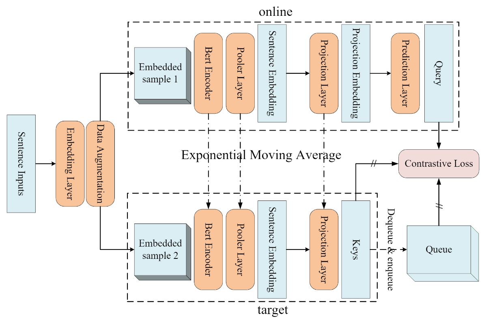

# mocose
We propose a momentum contrastive learning model to sentence embedding, namely MoCoSE.We focus on the effect of negative queue length in text comparison learning. 

NOTICE! You need to 1. download the [BERT weights](https://drive.google.com/file/d/1eG0zFgVH2PBBXUnYMgs_K9ODSV5ppoyd/view?usp=sharing) and change the path of the weights in demo. 2. download the sentEval and change the corresponding path in mocose_tools.

Our MoCoSE code, mocose.py contains the main constituent code of the model; mocose_tools.py contains the code of the tools to evaluate the model; and mocose_demo.ipynbs is the example code we provide for training or for evaluation.

It is worth noting that our code is built on transformers 4.4.2 and some code may no longer be adapted in the last few versions of updates. If you want to reproduce the code, please install transformers 4.4.2 version. Second, you will need to modify the location of the SentEval in the tools code to be used for evaluating the dataset.

Our MoCoSE-bert-base-uncased weights can be downloaded from the [link](https://drive.google.com/file/d/19eevBsaz8ApjgPfyx_hUtUsNlFYQ7riL/view?usp=sharing) below.

| STS12      | STS13 | STS14 | STS15 | STS16 | STS-Benchmark | SICK-R | Avg. |
| ----------- | ----------- |----------- |----------- |----------- |----------- |----------- |----------- |
| 71.48      | 81.40       |74.47       |83.45       |78.99       |78.68       |72.44       |77.27       |
